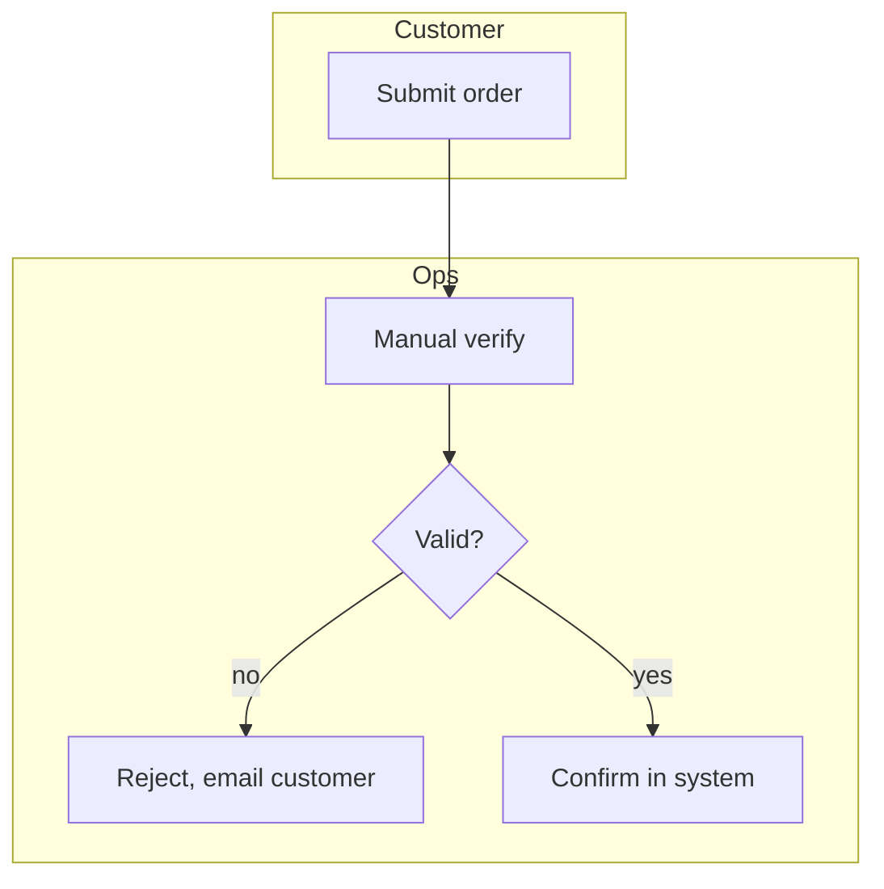

# Process & Gap Analysis Playbook

How to document current (as-is) and future (to-be) business processes and analyze the
gap between them. Load this for "process flow", "as-is / to-be", "gap analysis".

## As-is: map what happens today

- Capture the **actual** current process, not the idealized one. Walk it with the
  people who do it.
- For each step: actor, action, system/tool used, inputs/outputs, decision points,
  handoffs, and where time/errors/manual work pile up (the pain points).
- Note volume and frequency (how often, how many), and where data is created/changed.

Diagram with a swimlane/flow (Mermaid):

Mark pain points (manual steps, rework loops, long waits, error-prone handoffs).

## To-be: design the improved process

- Show the target process and how it removes the pain points (automation, fewer
  handoffs, system enforcement of rules, self-service).
- Keep it realistic and tied to the goal/metric it improves (cycle time, error rate,
  cost per transaction, conversion).

## Gap analysis

For each difference between as-is and to-be:

| Area | As-is | To-be | Gap | Impact | Action / Requirement | Priority |
|------|-------|-------|-----|--------|----------------------|----------|
| Order verification | Manual by ops | Auto-validated | No validation rules in system | High (delay, errors) | Build validation rule engine | Must |

- Classify each gap: people / process / technology / data / policy.
- Quantify the impact where possible (time saved, errors avoided, cost).
- Turn each gap into a requirement (link `brd-prd.md`) and a story (link
  `user-stories.md`).

## Impact analysis

- Who/what is affected by the change: stakeholders, systems, downstream processes.
- Change-management needs: training, comms, new SOPs.
- Risks of the transition and how to mitigate (phasing, parallel run, fallback).

## Quality bar

- As-is reflects reality (validated with practitioners), with pain points marked.
- To-be is tied to the goal/metric it improves and is feasible.
- Every gap is classified, impact-assessed, and converted into a prioritized action.
- Impacted stakeholders/systems and change-management needs identified.
