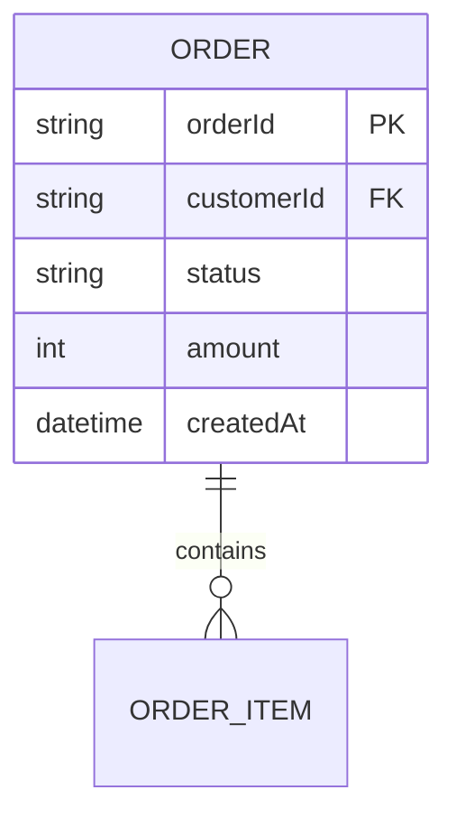
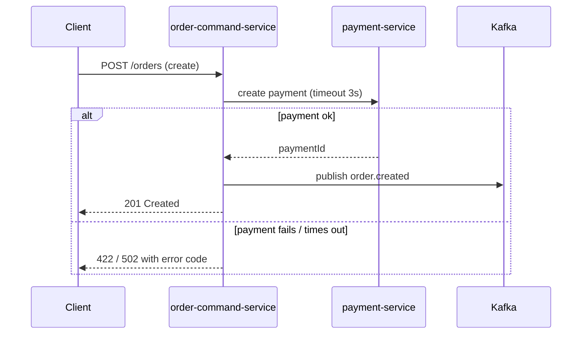

# API Contract & Data Model Playbook

How to specify a REST API contract and the data model behind it, for the GoFiber +
Mongo/GORM services. Load this for "API contract", "data model / ERD", "sequence
diagram" tasks.

## REST contract — specify every endpoint fully

For each endpoint, document:

- **Method + path** — resource-oriented, versioned, e.g.
  `POST /transaction/v1/orders`, `GET /transaction/v1/orders/{orderId}`.
- **Auth** — which middleware / scope is required.
- **Path/query params** — name, type, required?, constraints.
- **Request body** — every field: name, type, required?, nullable?, enum values,
  validation rule, example. (Maps to a `dto/server` request struct.)
- **Response body** — success shape (a `dto`, never the raw Mongo/GORM model), with
  the same field-level detail; the common-library response envelope.
- **Status codes & errors** — the full set: 200/201/204, 400, 401, 403, 404, 409,
  422, 429, 5xx — each tied to a condition and an error code/message.
- **Idempotency** — for POST that can be retried (payments, callbacks): the key and
  the dedupe behavior.
- **Pagination** — cursor/offset params, limits, and the meta shape, for lists.

Field table template:

| Field | Type | Req | Nullable | Rule / Enum | Example |
|-------|------|-----|----------|-------------|---------|
| transactionId | string | yes | no | UUID v4 | "a1b2…" |
| amount | number | yes | no | > 0, IDR minor units | 50000 |
| status | string | yes | no | PENDING\|PAID\|FAILED | "PAID" |

## Data model / ERD

- List **entities**, the **service that owns each** (one owner per entity — no shared
  tables/collections across services), and the storage (Mongo collection vs GORM table).
- For each entity: fields with type, nullability, defaults, indexes, and which are PII.
- Money as decimal/minor-units (never float); timestamps in UTC.
- Show relationships with a Mermaid ER diagram:

- State consistency expectations (strong vs eventual) and any cross-service read that
  must go through an API/event rather than a direct DB read.

## Sequence diagrams

Show the call/event flow for each significant operation, including the unhappy path.
Use Mermaid:

Always draw the failure/timeout branch — that's where systems break.

## Quality bar

- Every endpoint: all params, full request/response field detail, complete status set.
- Responses use DTOs, not persistence models.
- Each entity has one owning service; money/time typed correctly; PII flagged.
- Sequence diagrams include error/timeout branches and agree with the contract.
