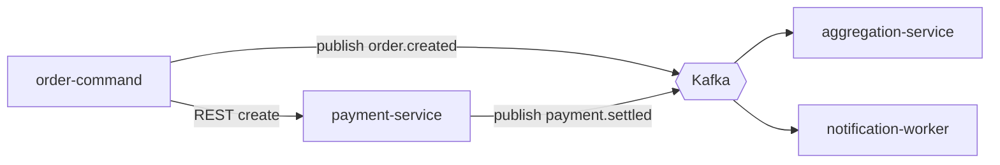

# Integration & Event-Flow Mapping Playbook

How to map how MyPertamina microservices talk to each other — synchronous REST calls
and asynchronous Kafka events — and the dependencies and failure modes between them.
Load this for "how should these services integrate", "event flow", "dependency map".

## Inventory first

For the feature in question, list:

- **Services involved** and their role: `*-command-service` (writes), `*-query-service`
  (reads), `*-orchestrator` (coordinates a workflow across services),
  `*-aggregation-service` (builds read models), `*-worker` (consumes events),
  `*-middleware`/`*-adapter` (integrates an external party).
- **Owned data** per service (no shared DB — cross-service data flows via API/event).
- **External systems** (payment providers, Finarya, LinkAja, etc.) and their adapters.

## Synchronous vs asynchronous — choose deliberately

- **Synchronous REST** when the caller needs the result now (e.g. create payment before
  confirming an order). Always specify: timeout, retry policy (only for idempotent
  calls), and what the caller does on failure/timeout (fail, fallback, compensate).
- **Asynchronous Kafka** when the work can be decoupled (notifications, read-model
  updates, downstream side effects). Specify the topic, the event schema, the
  producer, the consumer(s), ordering/partitioning key, and idempotency on the consumer
  (delivery is at-least-once).

Prefer events for fan-out and cross-domain side effects; prefer sync only where a
result is required inline. Avoid long synchronous chains (one slow hop stalls all).

## Event specification

For each event, document:

| Attribute | Value |
|-----------|-------|
| Topic | `order.paid` |
| Producer | order-command-service |
| Consumers | aggregation-service, notification-worker |
| Key (partition) | orderId |
| Schema | versioned payload, field-level detail |
| Trigger | when order transitions to PAID |
| Idempotency | consumer dedupes on (orderId, eventId) |
| Ordering | per-order ordering required? |

Version event schemas; additive changes only within a version. Define a dead-letter /
retry strategy for poison messages.

## Flow diagram

Map the end-to-end flow including compensation. Mermaid:

## Failure & consistency

- For each integration point, define the failure mode and handling: timeout, retry,
  circuit-break, fallback, or compensating action (saga). 
- State the consistency model: which steps are eventually consistent, and how the
  system converges (retries, reconciliation cron, idempotent replays).
- Call out idempotency keys for every retryable write or consumed event.
- Note operational signals: queue depth, consumer lag, error rate per integration.

## Quality bar

- Every service, event, and external dependency in the feature is listed with its role.
- Each integration point has a defined timeout/retry/failure behavior.
- Events have topic, schema (versioned), key, producer, consumers, idempotency.
- Diagram includes async edges and failure/compensation paths; consistency model stated.
