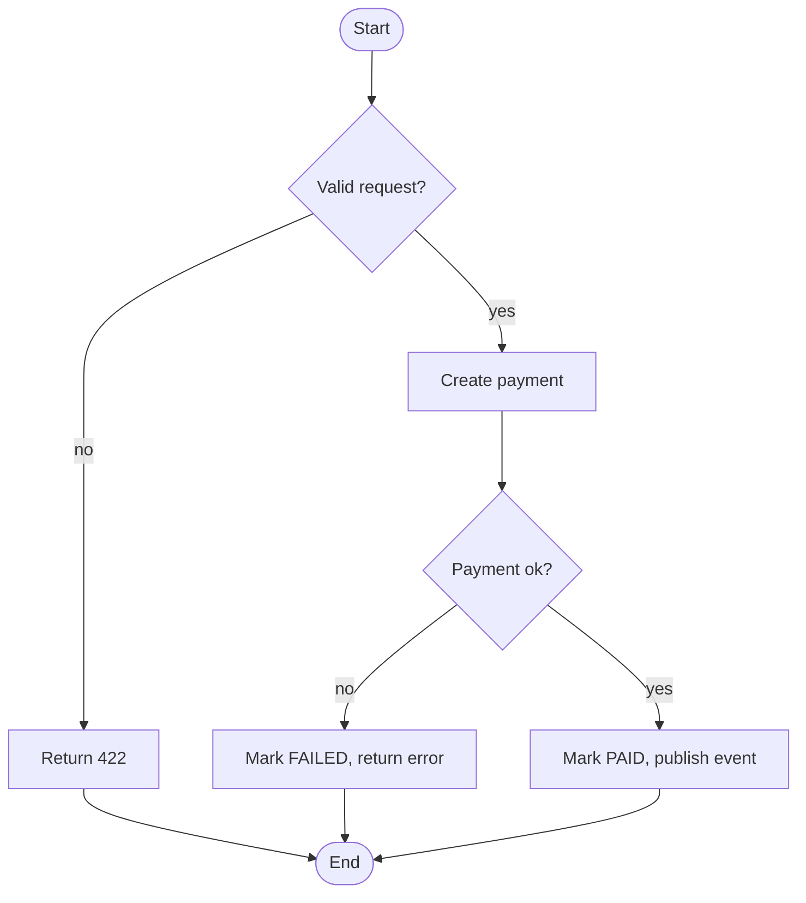

# Use-Case, Flow & Acceptance Criteria Playbook

How to specify use cases, activity/sequence flows, and acceptance criteria that QA
and engineering can act on. Load this for "use case for", "activity diagram",
"acceptance criteria".

## Use-case specification

For each use case:

- **ID & name** — `UC-1: Pay fuel direct order with MPS`.
- **Actor(s)** — primary + secondary (incl. systems/services).
- **Preconditions** — what must be true before it starts.
- **Trigger** — what initiates it.
- **Main flow** — numbered happy-path steps (actor action → system response).
- **Alternate flows** — branches (`UC-1.A`, `UC-1.B`).
- **Exception flows** — failures and how the system responds (`UC-1.E1`).
- **Postconditions** — state after success.
- **Business rules** — constraints that govern the behavior.

## Activity / flow diagram

Show the decision points and outcomes. Mermaid:



Every decision diamond needs all of its branches drawn, including the error exits.

## Acceptance criteria

Use **Gherkin** so criteria are executable and unambiguous:

```
AC-1
  Given an order in PENDING state
  When a valid MPS payment callback is received for its transactionId
  Then the order becomes PAID
  And an order.paid event is published
  And the API responds 200

AC-2 (idempotency)
  Given an order already in PAID state
  When a duplicate callback for the same transactionId is received
  Then the order state does not change
  And the API responds 200
```

Rules for good acceptance criteria:

- One scenario per criterion; cover happy path, each alternate, and each exception.
- Concrete inputs and observable outputs (status codes, state, events, UI result).
- Tie each AC back to a requirement ID (FR/NFR) and forward to a Jira story.
- Include negative and boundary cases (empty, max, concurrent, expired, unauthorized).

## Mapping to Jira

- Use case → Jira **story** (or epic if large). Each AC becomes a checklist item /
  test case. Link the Confluence spec to the Jira issue, and the Figma flow to both.

## Quality bar

- Use case has actors, pre/postconditions, main + alternate + exception flows.
- Diagram covers every branch including errors.
- Acceptance criteria in Gherkin, traceable to requirements and stories.
- Negative, boundary, and concurrency cases included — not just the happy path.
