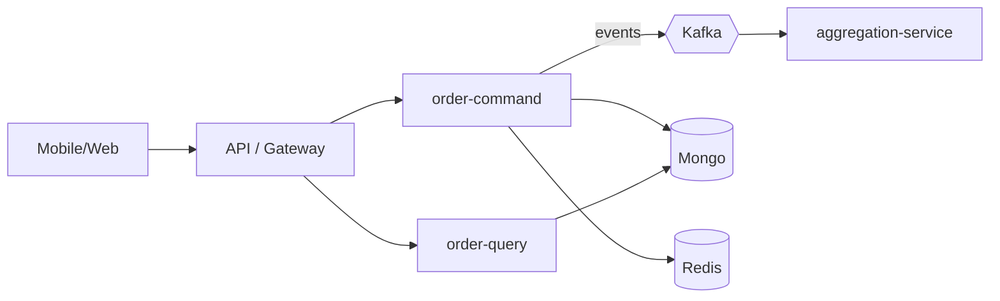

# System & Service Design Playbook

How to design a system or service: boundaries, components, and how it scales. Load
this for "design a system for", "service boundaries", "how should we architect".

## Start from constraints, not components

Pin down: expected load (req/s, events/s, data volume, growth), latency targets,
consistency needs, availability target, compliance, cost ceiling, and team/ops
capacity. The constraints decide the design — don't reach for components first.

## Service boundaries

- Split by **business capability** and **independent change/scale**, not by technical
  layer. A service owns a coherent domain and its data.
- **One owner per data entity.** Other services read it via API or via events into
  their own read model — never a shared DB or cross-service DB read.
- Follow the platform's CQRS split: `*-command-service` (writes/state changes),
  `*-query-service` (reads), `*-aggregation-service` (builds read models from events),
  `*-orchestrator` (coordinates a multi-service workflow), `*-worker` (consumes events),
  `*-middleware`/`*-adapter` (wraps an external party).
- **Default to a modular monolith / fewer services** until independent scaling,
  deployment cadence, or team ownership genuinely demands a split. Don't pay the
  distributed-systems tax early.

## Describe the design with C4-style views (Mermaid)

- **Context** — the system, its users, and external systems.
- **Container** — the services/datastores/queues and how they connect.
- **Sequence** — the flow for key operations, including failure branches.

## Scaling strategy

- Stateless services scale horizontally; keep state in datastores/cache, not memory.
- Identify the bottleneck (DB, a hot service, a queue) and scale/relieve that — don't
  scale everything blindly.
- Use caching (Redis, cache-aside) for read-heavy hot paths, with TTL + invalidation.
- Use async (Kafka) to absorb spikes and decouple slow work; bound concurrency and
  apply backpressure under overload (shed load with 429/503).
- Partition/shard data by a key that matches access patterns when a single store can't
  keep up.

## Quality bar

- Constraints and targets stated before components chosen.
- Boundaries respect single data ownership and the CQRS roles; split justified.
- Context + container + sequence views, with failure branches.
- Bottleneck and scaling approach identified; complexity matched to the requirements.
